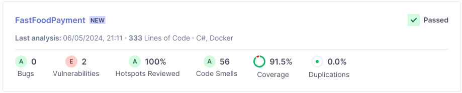
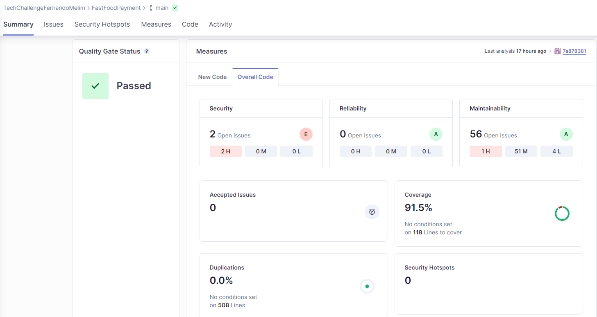

# FastFoodPayment

O repositorio FastFoodPayment tem por objetivo implementar uma Lambda Function responsável por lidar apenas com o meio de pagamento por QRCode pelo MercadoPago.

## Variáveis de ambiente
Todas as variáveis de ambiente do projeto visam fazer integração com algum serviço da AWS ou MercadoPago. Explicaremos a finalidade de cada uma:

- AWS_ACCESS_KEY_DYNAMO: "Access key" da AWS. Recurso gerado no IAM para podermos nos conectar aos serviços da AWS;
- AWS_SECRET_KEY_DYNAMO: "Secret key" da AWS. Recurso gerado no IAM para podermos nos conectar aos serviços da AWS. Deve ser utilizado corretamente com seu par AWS_ACCESS_KEY_DYNAMO;
- AWS_TABLE_NAME_DYNAMO: Tablea do dynamo utilizada por este serviço para salvar os dados do pagamento.
- AWS_SQS_LOG: Url da fila de log no SQS da AWS.
- AWS_SQS_GROUP_ID_LOG: Group Id da fila de log no SQS da AWS.
- AWS_SQS_PRODUCTION: Url da fila de enviar pedidos para produção no SQS da AWS.
- AWS_SQS_GROUP_ID_PRODUCTION: Group Id da fila de enviar pedidos para produção no SQS da AWS.
- BASE_URL_MERCADO_PAGO: Url da api do emrcado pago
- ACCESS_TOKEN_MERCADO_PAGO: Access Token gerado pelo merdao pago para poder acessar a API deles.
- USER_ID_MERCADO_PAGO: Id de usuário no mercado pago.
- EXTERNAL_POS_ID_MERCADO_PAGO: Id externo da loja aberta no mercado pago.

## Execução do projeto

A execução do projeto pode ser feita buildando o dockerfile na raiz do repositório e depois executando a imagem gerada em um container. O serviço foi testado sendo executado direto pelo visual Studio e pela AWS.

## Testes

Conforme foi solicitado, estou postando aqui as evidências de cobertura dos testes. A cobertura foi calculada via integração com o [SonarCloud](https://sonarcloud.io/) e pode ser vista nesse [link](https://sonarcloud.io/organizations/techchallengefernandomelim/projects). A integração com todos os repositórios poderá ser vista nesse link.

Através das imagens é possível observar que a cobertura por testes unitários ficou superior a 80%, conforme solicitado.

## Endpoints

Os endpoints presentes nesse projeto são:

- POST /CreatePayment: Responsável por criar o pedido no Mercado Pago e retornar o QR Code(PIX) para pagamento do pedido. Esse endpoint é chamado quando o cliente está criando um pedido. 
- PATCH /UpdatePayment/{in_store_order_id}: Responsável por atualizar o status do pagamento do pedido e por enfileirar o pedido para a produção caso o mesmo tenha sido pago.